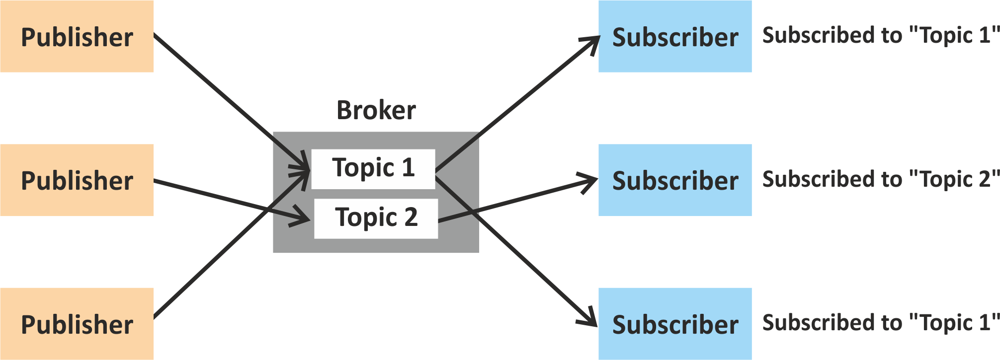
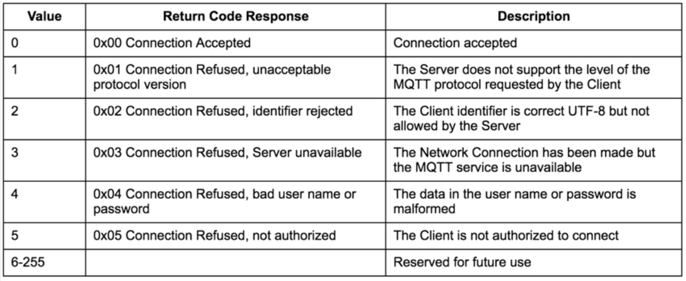
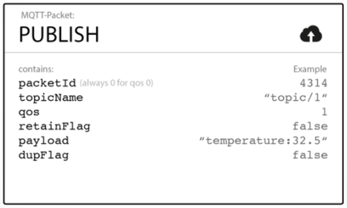
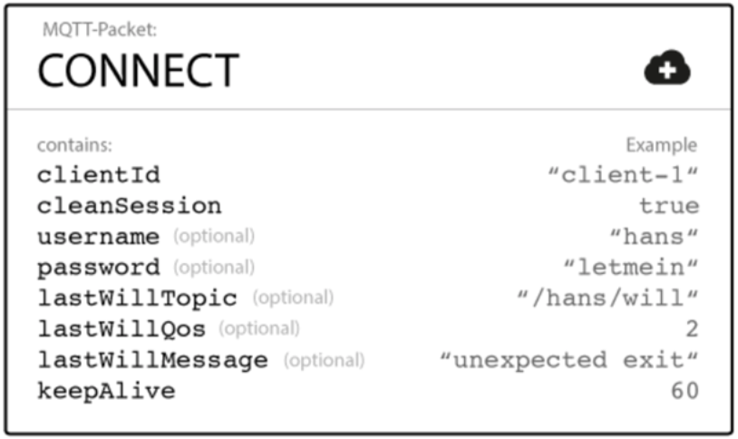

<!--MQTT-->

MQTT

## MQTT: Basics

**M**essage **Q**ueue **T**elemetry **T**ransport

_"Publish-subscribe-based "lightweight" messaging protocol, for use on top of the TCP/IP protocol."_

* Publish-subscribe
* A **message broker** is required
* Standard: ISO/IEC PRF 20922
* Small code footprint
* Limited network bandwidth / constrained environments
* Developed in 1999 (and released royalty free in 2010)
* Data agnostic

## MQTT: Publish-subscribe model

 

## MQTT: Connecting to the broker

 

## MQTT: Publishing to a topic

 

## MQTT: Subscribing to a topic

### >_ Example topics

* Topic #1: `home/groundfloor/kitchen/temperature`
* Topic #2: `office/conferenceroom/luminance`

### >_ Wild cards

* Single-level: `home/groundfloor/+/temperature`  
_(to subscribe to **all the temperature readings** in all the rooms of the ground floor)_
* Multi-level: `home/groundfloor/#`  
_(to subscribe to **all the readings** in all the rooms of the ground floor, **not only the temperature**)_

## MQTT: Quality of Service

### >_ QoS can be 0, 1, or 2

* 0: The broker/client will deliver the message once, with no confirmation.
* 1: The broker/client will deliver the message at least once, with confirmation required.
* 2: The broker/client will deliver the message exactly once by using a four step handshake.

## MQTT: Last will and testament

 

## MQTT: Learn more

There are client libraries and wrappers for practically all languages used in M2M setups, as well as different brokers/servers.

* Learn more: **[mqtt.org](http://mqtt.org)**
* Software: **[mqtt.org/software](http://mqtt.org/software)**
* Recommended broker: **Mosquitto ([mosquitto.org](https://mosquitto.org))**
* Lots of good tutorials out there

------------------