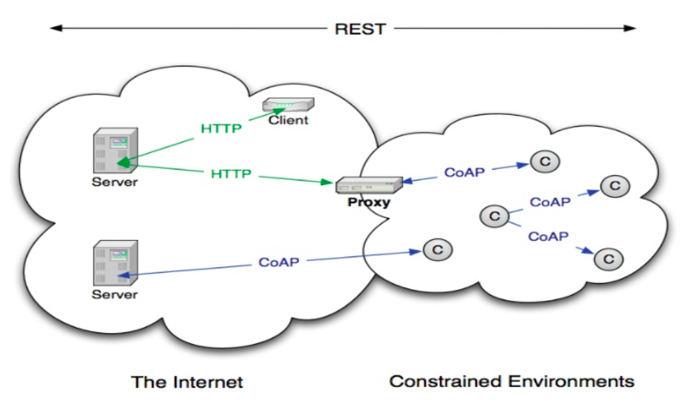
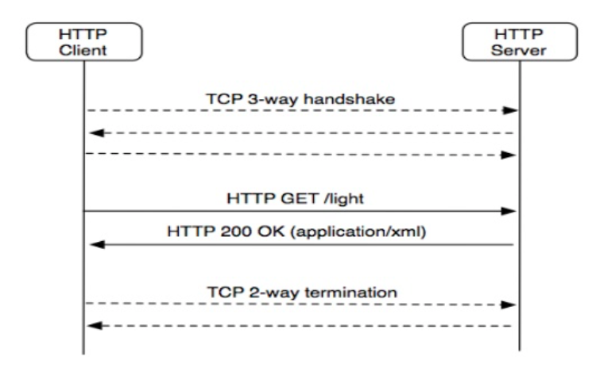
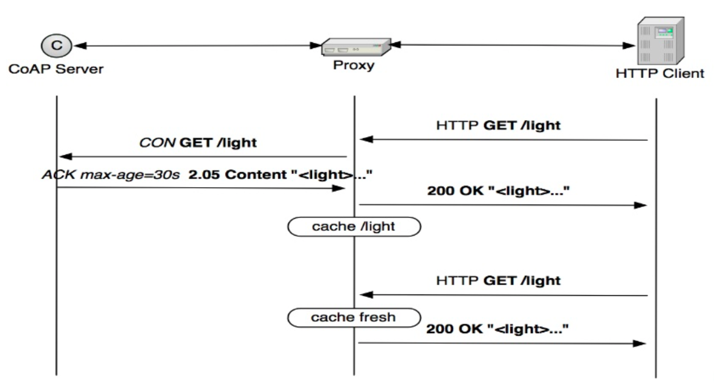
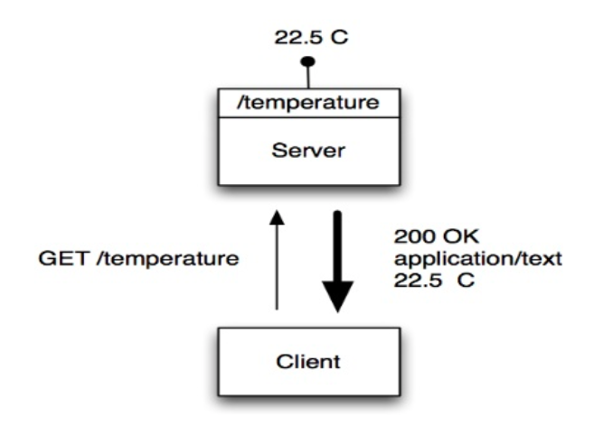
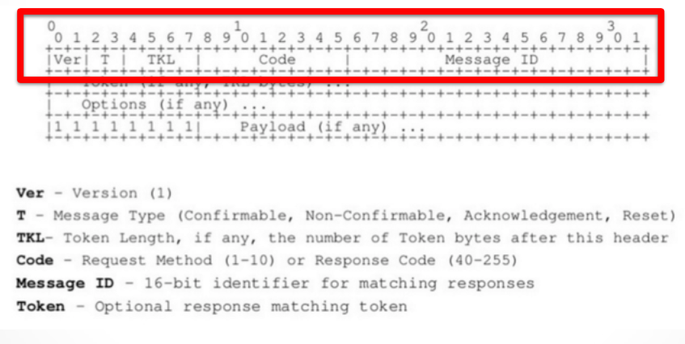
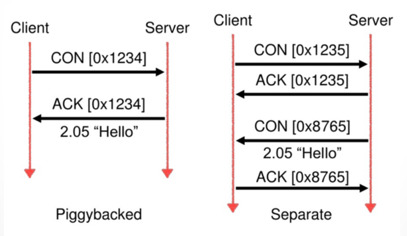
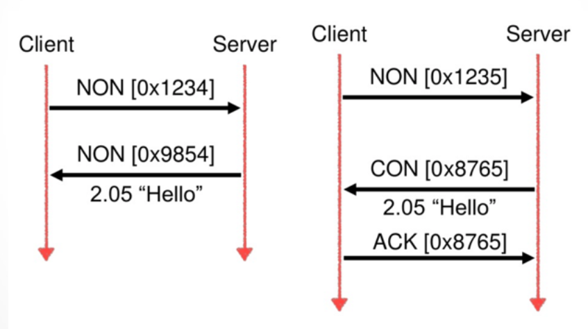
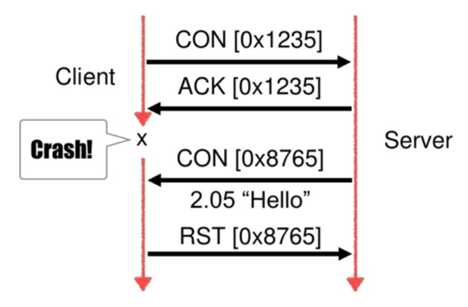
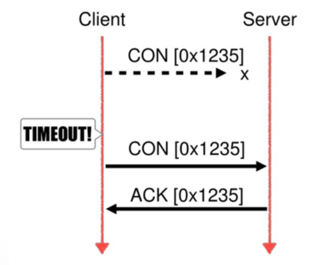
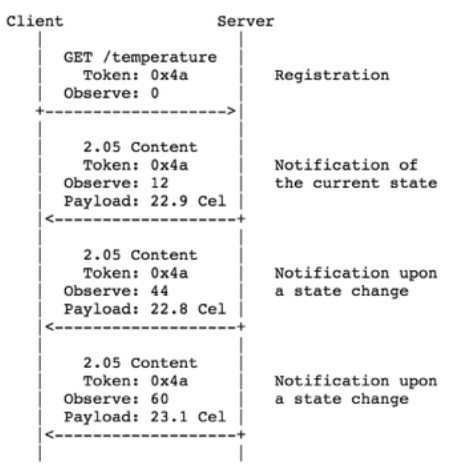

<!--CoAP-->

<div class="vertically-centered"><font size="150%">
CoAP
</font></div>


## CoAP: Basics

**Co**nstrained **A**pplication **P**rotocol

_"A specialized web transfer protocol for use with constrained nodes and constrained networks in the Internet of Things."_

<br/>

* CoRE, IETF group
* Proposed standard: RFC 7252
* **CoAP ~ lightweight fast HTTP**
* Designed for manipulation of simple resources on
constrained node networks


## CoAP: RESTful environment

<br/>
<p style="text-align:center;">

</p>


## CoAP: Inspired by HTTP

<br/>
<p style="text-align:center;">

</p>


## CoAP <---> Proxy <---> HTTP 

<br/>
<p style="text-align:center;">

</p>


## CoAP: HTTP vs CoAP

<br/>
<p style="text-align:center;">

</p>


## CoAP: Functionalities

<br/>

* URI
* GET / POST / PUT / DELETE
* Content-type support (XML, JSON, CBOR,...)
* **Built-in discovery** &mdash; `.well-known/core`
* **Multicast support**
* Asynchronous message exchanges
* Designed to be extensible


## CoAP: Client / Server

<p style="text-align:center;">

</p>


## CoAP: Message format

<br>
<p style="text-align:center;">

</p>

<!-- TABLE IN ASCII, just because it's cool!

```
0                   1                   2                   3
0 1 2 3 4 5 6 7 8 9 0 1 2 3 4 5 6 7 8 9 0 1 2 3 4 5 6 7 8 9 0 1
+-+-+-+-+-+-+-+-+-+-+-+-+-+-+-+-+-+-+-+-+-+-+-+-+-+-+-+-+-+-+-+-+
|Ver| T |  TKL  |      Code     |          Message ID           |
+-+-+-+-+-+-+-+-+-+-+-+-+-+-+-+-+-+-+-+-+-+-+-+-+-+-+-+-+-+-+-+-+
|   Token (if any, TKL bytes) ...
+-+-+-+-+-+-+-+-+-+-+-+-+-+-+-+-+-+-+-+-+-+-+-+-+-+-+-+-+-+-+-+-+
|   Options (if any) ...
+-+-+-+-+-+-+-+-+-+-+-+-+-+-+-+-+-+-+-+-+-+-+-+-+-+-+-+-+-+-+-+-+
|1 1 1 1 1 1 1 1|    Payload (if any) ...
+-+-+-+-+-+-+-+-+-+-+-+-+-+-+-+-+-+-+-+-+-+-+-+-+-+-+-+-+-+-+-+-+
```

-->


## CoAP: Confirmable

<br/>
<p style="text-align:center;">

</p>


## CoAP: Non-confirmable

<br/>
<p style="text-align:center;">

</p>


## CoAP: Reset

<br/>
<p style="text-align:center;">

</p>


## CoAP: Reliability

<br/>

* Message reliability is handled at the application layer (UDP)
* Congestion control (retransmits increase exponentially up to 247 s) &mdash; further improvements coming
* These features can be disabled, if speed is the goal


## CoAP: Reliability

<br/>
<p style="text-align:center;">

</p>


## CoAP: Observing resources I

<br/>

* Protocol extension for CoAP: RFC 7641
* Client interested in a resource over period of time
* Observer pattern
* Server ~ Client (constrained device acts as a server)


## CoAP: Observing resources II

<br/>
<p style="text-align:center">

</p>


## CoAP: Observing resources III

<br/>

* Protocol extension for CoAP, draft
* It transfers larger resource representations than can be usually accommodated in constrained networks
* Response is split in blocks
* Both sides have a say in the block size that actually will used
* CoAP over TCP being drafted
* Authentication & authorization inspired by OAUTH and JWT


## CoAP: Learn more

<br/>

* General info: **[`coap.technology`](http://coap.technology)**
* Proposed standard: **[`tools.ietf.org/html/rfc7252`](https://tools.ietf.org/html/rfc7252)**
* Copper (CoAP user-agent as a Firefox add-on): **[`github.com/mkovatsc/Copper`](https://github.com/mkovatsc/Copper)**
* Several tutorials and cool features to discover


------------------