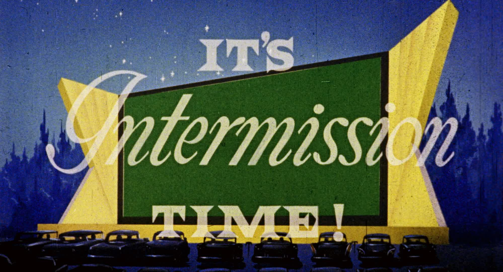
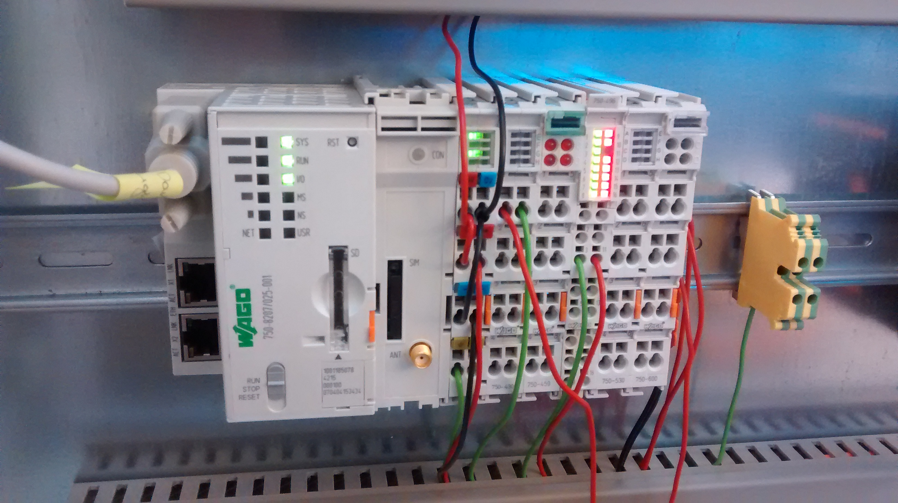
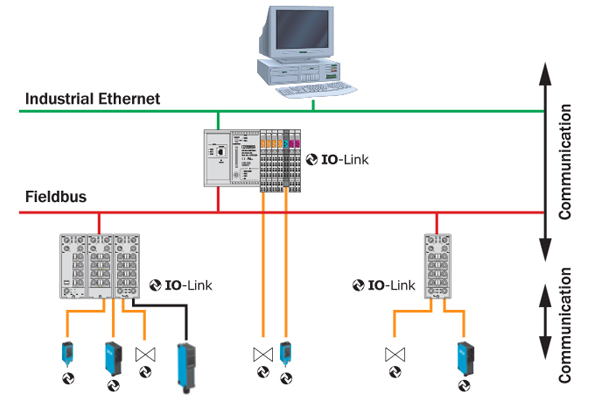
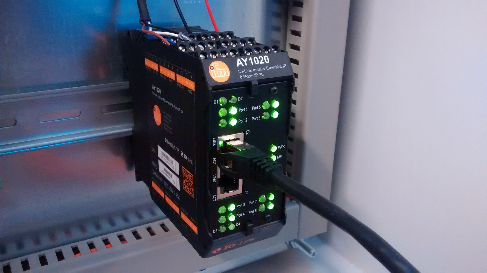
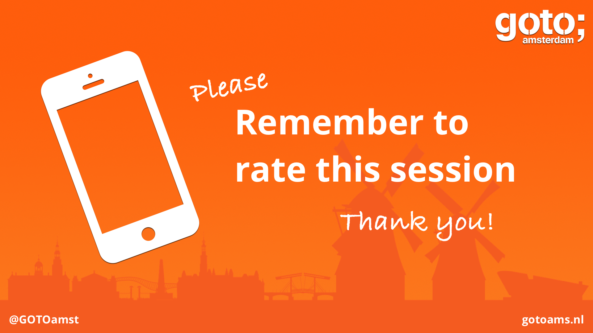

<!--Intermission-->

 

------------------

Adoption of IoT Protocols in Industry

## What's a Fieldbus?

_"Industrial, digital bus used for real-time distributed control."_

* Mainly used in manufacturing (assembly lines, process control, etc.)
* Connects instruments in the shop-floor
* Allows different topologies (daisy-chain, tree, etc.)
* Bla bla bla

------------------

## Fieldbus and Industrial Ethernet standards

* Modbus RTU (serial) (published in **1979!**)
* Modbus TCP (Ethernet)
* Profibus (serial)
* CAN (a _vehicle bus_, in reality)
* Bitbus
* EtherCAT
* DeviceNET
* BACnet (_Although I wouldn't call it a fielbus..._)
* Etc.

------------------

## Industrial Ethernet standards

* Profinet
* CAN (a _vehicle bus_ in reality)
* 

## What's a PFC?

**P**rogrammable **F**ieldbus **C**ontrollers

* Not to be confused with a PLC (Programmable **Logic** Controller)
* They often support different fieldbuses by default
* Easily expandable (new I/O modules can be attached, motor drivers, etc.)
* Most of them run an OS
* Manufacturers 

## What's a PFC?

------------------

## IO-Link: _State of the art_

_"Quote that summarizes the protocol..."_

* **Not a fieldbus**
* Bla bla bla

------------------

## IO-Link: Topology example

------------------

## IO-Link: Master / sensor aggregator

------------------

## OPC-UA: _State of the art_

_"Quote that summarizes the protocol..."_

* **Not a protocol**, but a "unified architecture"
* Bla bla bla

------------------

<!--This image was provided by the organizers to encourage the attendees to rate the session. There's a similar image at the beginning of the presentation. Instead of Markdown, HTML is used to make sure the picture is adequately scaled.-->

