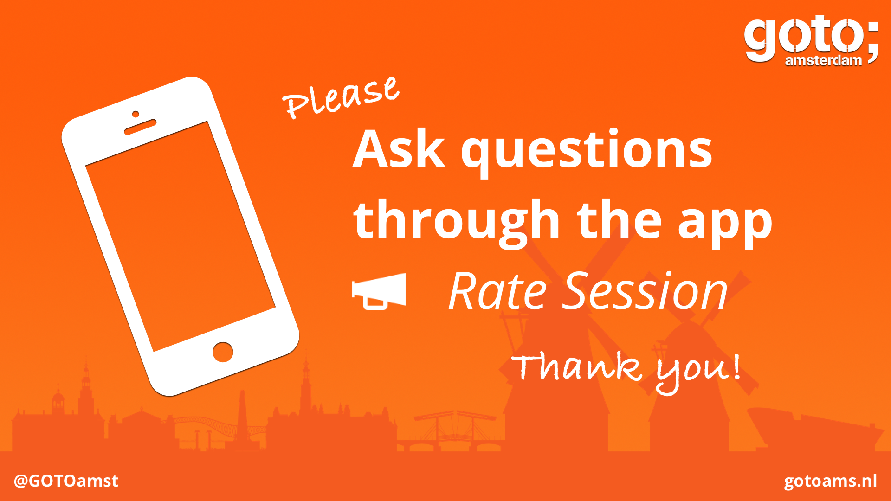
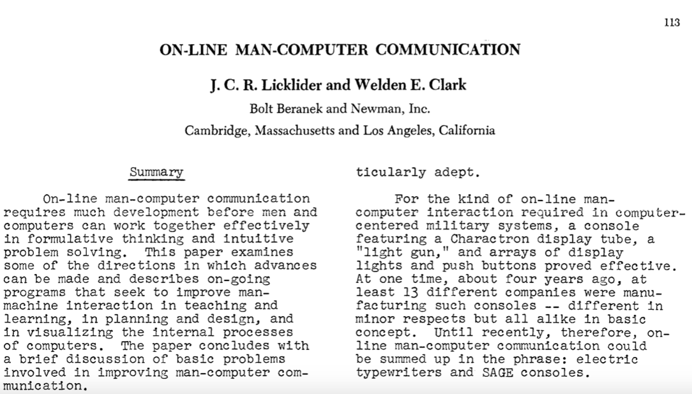
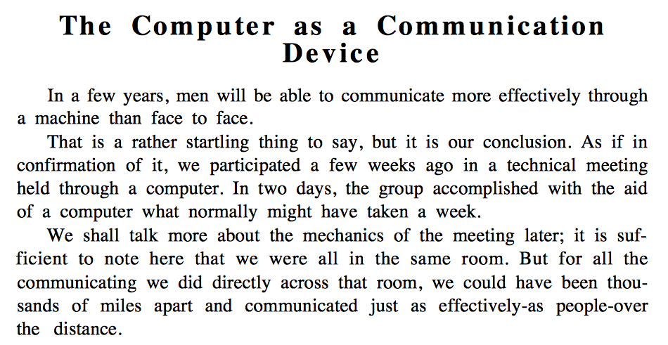
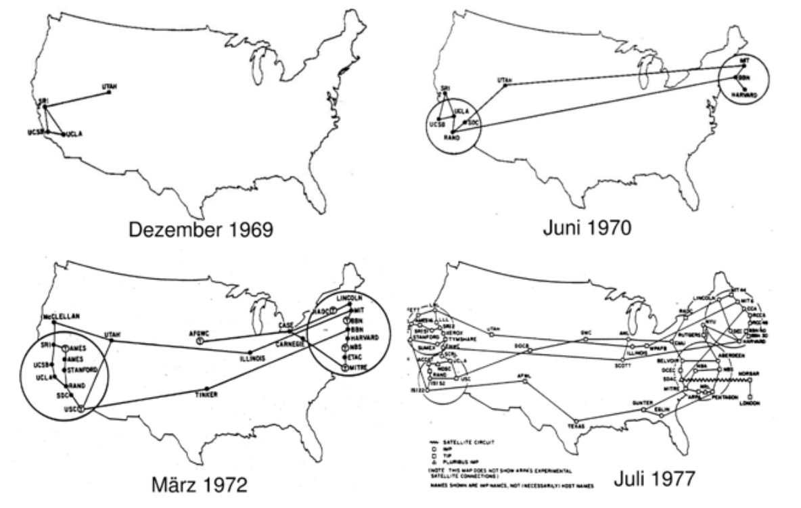
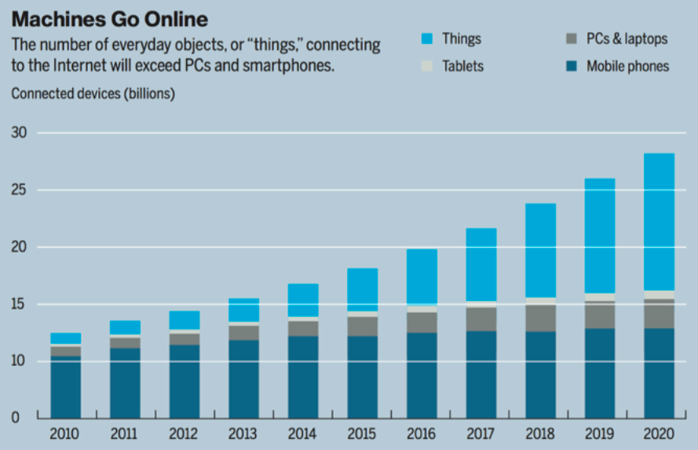

% A Gentle Introduction to IoT Protocols: MQTT, CoAP, HTTP & WebSockets  
% Antonio Almeida and Jaime González-Arintero  
% June 14, 2017

------------------

<!--This image was provided by the organizers to encourage the attendees to rate the session. There's a similar image at the end of the presentation. Instead of Markdown, HTML is used to make sure the picture is adequately scaled.-->

## Visionaries

### >_ On-line Man-Computer Communication, 1962

## Visionaries

### >_ The Computer as a Communication Device, 1968

## Arpanet

------------------

<!--WHY MORE PROTOCOLS?-->

Why more protocols?

<!-- Use the image from La Dolce Vita -->

## Connected devices

### >_ Some figures...

<blockquote style="float:right">-MIT Technology Review, 2014</blockquote> 

## Connected devices

### >_ Some figures...

* 14 bn connected devices | Bosch SI
* 50 bn connected devices | Cisco
* 309 bn IoT supplier revenue | Gartner
* 1.9 tn IoT economic value add | Gartner
* 7.1 tn IoT solutions revenue | IDC

> _By 2020, component costs will have come down to the point that connectivity will become standard feature, even for processors costing **less than $1**._  
- Peter Middleton, Gartner

## Constrained devices

* IETF Definition: **[tools.ietf.org/html/rfc7228](https://tools.ietf.org/html/rfc7228)**
* Limited processing power
* Unreliable networking
* Low power _(so they can run on batteries)_

## Internet a definition

> a computer network consisting of a worldwide network 
> of computer networks that use the TCP/IP network protocols
> to facilitate data transmission and exchange